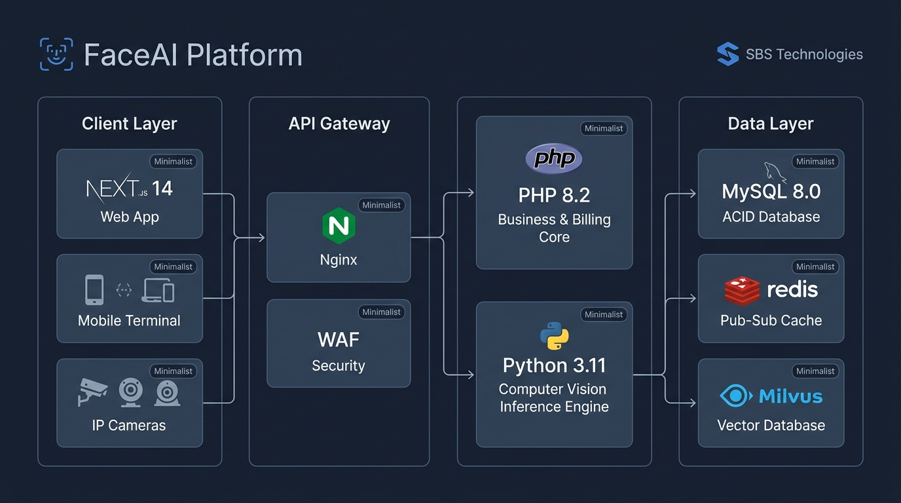
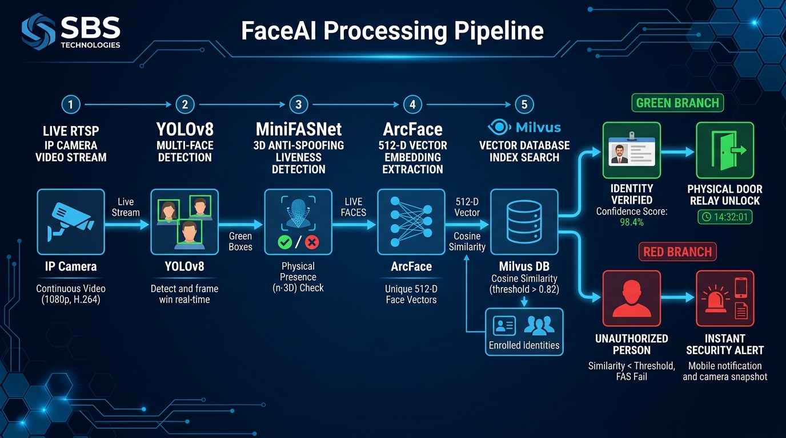
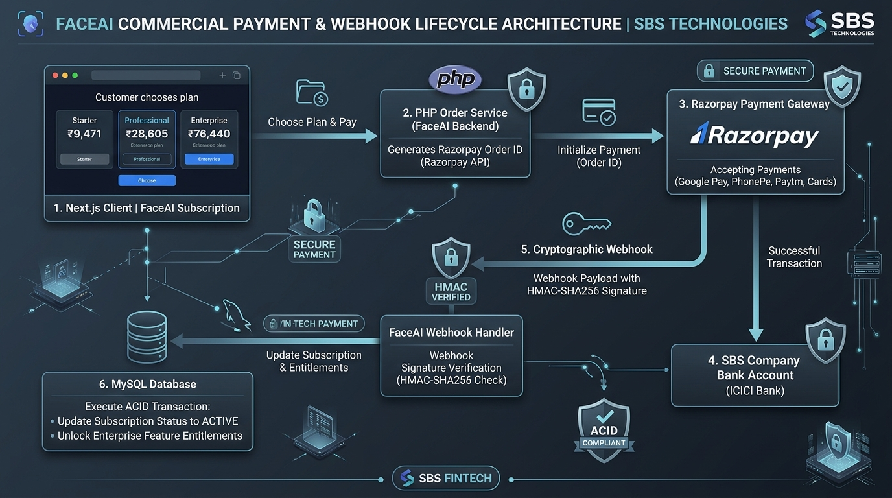
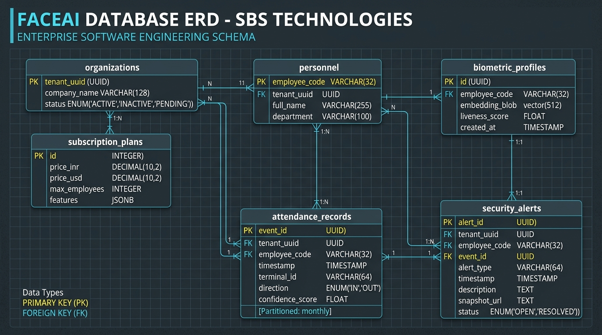

# 🏛️ FaceAI Enterprise Architecture Blueprints
**Company:** SBS Technologies  
**Platform:** FaceAI — Smart Identity, Biometric Attendance & Security Access Platform  

This directory contains the visual system architecture diagrams and technical specifications for the complete FaceAI ecosystem.

---

## 📑 Visual Architecture Index

| # | Diagram Name | File | Primary Scope |
| :-: | :--- | :--- | :--- |
| **1** | **High-Level System Architecture** | `1_system_architecture.jpg` | 4-Tier Distributed Cloud Ecosystem (Next.js, Gateway, PHP & Python Clusters, Data Layer) |
| **2** | **Computer Vision DAG Pipeline** | `2_vision_pipeline.jpg` | Real-time RTSP stream processing, YOLOv8 detection, 3D anti-spoofing, vector search & door relays |
| **3** | **Commercial Payment & Webhook Lifecycle** | `3_payment_lifecycle.jpg` | Razorpay checkout, escrow settlement (T+1), HMAC-SHA256 webhooks & MySQL subscription activation |
| **4** | **Database Entity Relationship Diagram (ERD)** | `4_database_erd.jpg` | Multi-tenant schema, vector profiles, monthly partitioned attendance logs & security audit trails |

---

## 1. 🌐 High-Level System Architecture

### Architectural Decomposition:
* **Client Layer:** Next.js 14+ PWA Client, Mobile Attendance Terminals, and RTSP IP Camera network.
* **API Gateway & Reverse Proxy:** Nginx with Web Application Firewall (WAF), rate limiting, and SSL/TLS 1.3 termination.
* **Dual Compute Clusters:**
  * **PHP 8.2 Business Core:** Dedicated to user administration, subscription licensing, Razorpay webhooks, and HRMS data sync.
  * **Python 3.11 Computer Vision Engine:** High-throughput CUDA/TensorRT worker pool performing sub-100ms multi-face detection.
* **Storage & Caching Layer:**
  * **MySQL 8.0:** ACID transactional persistence and attendance audit ledgers.
  * **Redis 7.0:** In-memory Pub-Sub broker powering real-time WebSocket telemetry.
  * **Milvus:** Distributed vector database indexing 512-D face embeddings.

---

## 2. ⚡ Real-Time Computer Vision DAG Pipeline

### Sequential Detection Stages:
1. **Live RTSP Ingestion:** 1080p @ 25fps H.264/H.265 video stream ingested from on-premise IP cameras.
2. **YOLOv8 Multi-Face Detection:** Simultaneously tracks and bounds up to 10 overlapping faces per frame in under 18ms.
3. **MiniFASNet 3D Anti-Spoofing:** Depth and Fourier frequency analysis blocks photo prints, mobile screens, and silicone masks.
4. **ArcFace Embedding Extraction:** Generates an invariant 512-dimensional Euclidean face vector embedding.
5. **Milvus HNSW Vector Match:** Cosine similarity search against registered employee templates.
6. **Dual-Branch Resolution:**
   * 🟢 **Green Branch (Match $\ge$ 0.75):** Identity verified $\rightarrow$ sends GPIO pulse to physical turnstile/door relay $\rightarrow$ logs attendance check-in.
   * 🔴 **Red Branch (Match < 0.60 or Liveness Fail):** Unknown/Spoof detected $\rightarrow$ triggers instant security alerts via WhatsApp & SMS.

---

## 3. 💳 Commercial Payment & Webhook Lifecycle

### Financial & Entitlement Flow:
1. **Plan Selection:** Client selects Starter (₹9,471), Professional (₹28,605), or Enterprise (₹76,440).
2. **Order Initialization:** PHP backend creates an internal order record in MySQL (`PENDING`) and requests a Razorpay Gateway Order ID.
3. **Checkout Execution:** Client completes payment via Google Pay, PhonePe, Paytm, WhatsApp Pay, or Credit/Debit Cards.
4. **Direct Bank Settlement:** Razorpay escrows funds and auto-settles directly into the SBS Technologies company bank account (T+1 cycle).
5. **Signed Webhook Dispatch:** Razorpay dispatches an `order.paid` event signed with an `X-Razorpay-Signature` HMAC-SHA256 header.
6. **ACID DB Transaction:** PHP verifies the signature, enforces idempotency, updates order status to `PAID`, and unlocks tier feature gates in MySQL.

---

## 4. 🗄️ Enterprise Database Entity Relationship Diagram (ERD)

### Core Relational Entities:
* **`organizations`:** Multi-tenant workspace entities with unique tenant UUIDs and industry classifications.
* **`subscription_plans`:** Plan metadata, employee quota limits, and boolean feature flags.
* **`personnel`:** Registered employees, contractors, and recurring visitors.
* **`biometric_profiles`:** Encrypted 512-D float vectors and liveness quality benchmark scores.
* **`attendance_records`:** Monthly range-partitioned ledger tracking direction (`IN`/`OUT`), confidence scores, and timestamps.
* **`security_alerts`:** Audit logs recording unknown face sightings, spoof attempts, and notification status.
